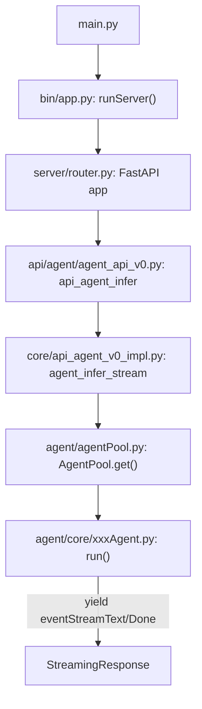

# 项目架构总览（awesome-digital-human-live2d）

## 一、整体架构
- 前端（web）：Next.js + React + Tailwind + HeroUI，负责数字人交互界面、Live2D 渲染、与后端 API 通信。
- 后端（digitalHuman）：FastAPI，负责 ASR（语音识别）、TTS（语音合成）、Agent（对话/大模型）、LLM（大模型，预留）等服务，支持多种引擎扩展。
- 配置（configs）：支持多引擎/多 Agent 的 yaml 配置，热插拔。
- 部署：支持裸机开发、Docker 容器化、nginx 反向代理。

## 二、主要目录结构
- web/ 前端主目录
  - app/ 页面与业务逻辑
  - lib/ 协议、API、常量、Live2D SDK 封装
  - public/ 静态资源（人物模型、背景、embed.js）
- digitalHuman/ 后端主目录
  - engine/ asr、tts、llm 各类引擎实现与注册
  - agent/ Agent 实现与注册
  - server/ FastAPI 路由、API 实现
  - utils/ 工具与通用模块
- configs/ 各类引擎与 Agent 的 yaml 配置
- docker/ Dockerfile、nginx 配置

## 三、核心流程
1. 用户通过 web 前端与数字人交互（文字/语音输入、Live2D 渲染、参数设置等）。
2. 前端通过 RESTful API/WebSocket 与后端通信，API 路径统一以 /adh/ 开头。
3. 后端根据 configs 配置动态加载/切换 ASR、TTS、Agent 等引擎，支持多种第三方服务（如 Dify、FastGPT、OpenAI、阿里云等）。
4. 语音识别、语音合成、对话推理等均为可插拔模块，便于扩展。
5. 前端支持人物模型、背景、主题等自定义，Live2D 渲染与控制。

## 四、扩展点
- 新增/替换 ASR、TTS、Agent、LLM 引擎：在 engine/agent 目录下实现并在 configs/engines/agents 下配置。
- 新增人物模型/背景：添加到 web/public/sentio/characters 或 backgrounds，并在 web/lib/constants.ts 注册。
- 前后端均支持热插拔和多实例配置。

## 五、部署与开发建议
- 本地开发推荐裸机启动，前后端分离，热更新高效。
- 生产/公网推荐 Docker 容器部署，环境一致、易维护。
- 支持 ngrok/内网穿透临时公网体验。

## 六、参考文档
- [部署说明](./docs/deploy_instrction.md)
- [开发说明](./docs/developer_instrction.md)
- [常见问题](./docs/Q&A.md)
- [Live2D 官方](https://www.live2d.com/zh-CHS/learn/sample/)

如需二次开发或定制，建议先通读本文件和 developer_instrction.md。

## 七、后端对话功能主流程（代码调用链）

### 1. 入口 main.py
- `main.py` 作为启动入口，调用 `runServer()`。

### 2. 启动服务 digitalHuman/bin/app.py
- `runServer()` 初始化引擎池（EnginePool）、Agent池（AgentPool），并启动 FastAPI 服务（`uvicorn.run(app, ...)`）。

### 3. 注册 API 路由 digitalHuman/server/router.py
- FastAPI app 注册 `/adh/agent/v0/engine` 等路由，核心对话推理接口为：
  - `POST /adh/agent/v0/engine` → `api_agent_infer`

### 4. 对话推理 API digitalHuman/server/api/agent/agent_api_v0.py
- `api_agent_infer` 接收前端请求，调用 `agent_infer_stream`，返回 StreamingResponse 实现流式对话。

### 5. 推理实现 digitalHuman/server/core/api_agent_v0_impl.py
- `agent_infer_stream(user, items)`：
  - 通过 `AgentPool.get(items.engine)` 获取指定 Agent 实例
  - 调用 `run(input, user, streaming=True, conversation_id, **config)` 执行推理
  - 返回流式生成器（yield eventStreamXXX）

### 6. Agent 动态注册与实现
- Agent 通过 `AGENTS.register("xxx")` 动态注册，支持 Dify、OpenAI、FastGPT、Repeater 等多种类型。
- 每个 Agent 继承自 `BaseAgent`，实现 `async def run(...)` 方法，支持流式 yield 返回。

#### 典型 Agent 实现
- `digitalHuman/agent/core/difyAgent.py`：对接 Dify 平台，流式 yield answer。
- `digitalHuman/agent/core/openaiAgent.py`：对接 OpenAI API，流式 yield answer。
- `digitalHuman/agent/core/fastgptAgent.py`：对接 FastGPT，流式 yield answer。
- `digitalHuman/agent/core/repeaterAgent.py`：复读机，直接返回输入。

### 7. 协议与数据结构
- 所有对话消息、事件、参数、用户等均有统一协议（`digitalHuman/protocol.py`）。
- 流式返回采用 SSE（Server-Sent Events）格式，事件类型有 TEXT、THINK、DONE、ERROR 等。

#### 流程图

## 八、前端对话功能主流程（代码调用链）

### 1. 页面入口
- `web/app/(products)/sentio/app.tsx` 作为主页面，加载 Header、ChatBot、Live2d。

### 2. ChatBot 组件
- `web/app/(products)/sentio/components/chatbot/index.tsx` 负责渲染对话 UI，调用 `useChatWithAgent` hook 实现对话。

### 3. 对话逻辑
- `web/app/(products)/sentio/hooks/chat.ts`：
  - `useChatWithAgent` hook 管理对话状态、消息流、调用 API。
  - 通过 `api_agent_stream`（`web/lib/api/server.ts`）发起流式对话请求。
  - `api_agent_stream` 内部用 fetch-event-source 处理 SSE 流，实时更新前端消息。

### 4. API 封装
- `web/lib/api/server.ts`：统一封装所有后端 API，所有对话相关请求都走 `/adh/agent/v0/engine`。
- `web/lib/api/requests.ts`：自动适配 API baseURL，兼容本地、ngrok、生产等多环境。

### 5. 状态管理
- `web/lib/store/sentio.ts`：用 zustand 管理对话、角色、引擎、主题等全局状态。

### 6. Live2D 渲染
- `web/lib/live2d/live2dManager.ts` 负责 Live2D 模型加载、动作控制、与对话联动。
- 页面通过 `Live2d` 组件渲染数字人形象。

### 7. 典型流程
1. 用户输入消息，ChatBot 组件调用 `chat()` 方法。
2. `useChatWithAgent` 通过 `api_agent_stream` 发起流式请求。
3. 后端返回流式事件，前端实时渲染对话内容和 Live2D 动作。
4. 状态和 UI 自动同步，支持多轮对话、参数切换、模型切换等。

如需更细致的代码注释或流程图，可进一步补充。 